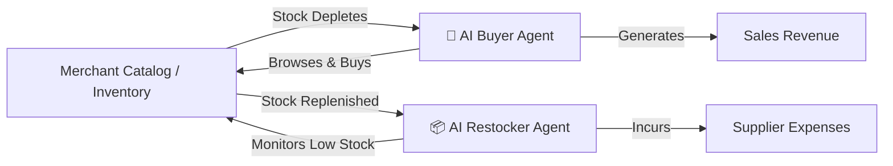
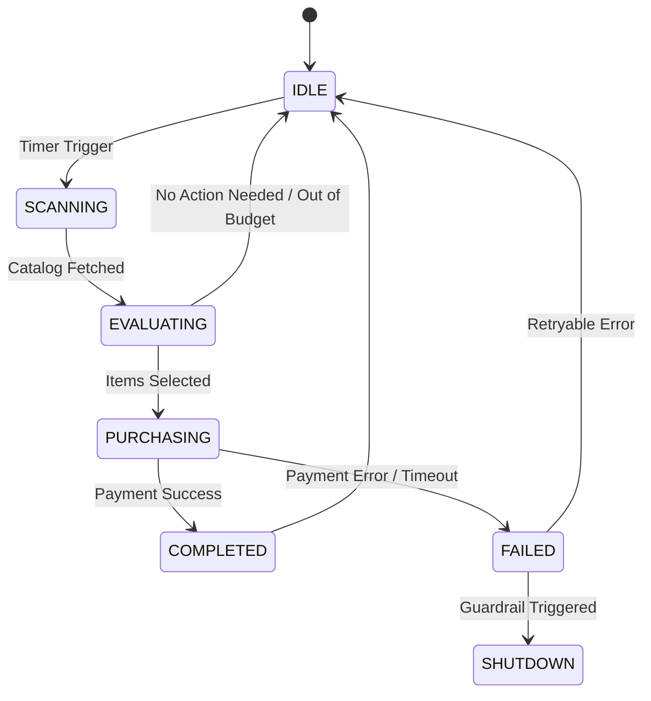

# Autonomous Agentic Commerce Engine 🤖🛒

[](https://nodejs.org/)
[](https://expressjs.com/)
[](https://razorpay.com/)

## Overview
The Autonomous Agentic Commerce Engine is a machine-to-machine (M2M) commerce platform demonstrating how AI agents interact with merchant infrastructure. 

This project specifically demonstrates two contrasting autonomous agents:
1. **The AI Buyer (External Consumer):** Simulates external market demand. It browses the catalog, autonomously decides what to purchase based on availability, and executes Razorpay checkouts, generating **Sales Revenue** and depleting stock.
2. **The AI Restocker (Internal Manager):** Works for the merchant. It constantly monitors inventory levels, identifies low stock (`stock <= reorder_threshold`), and automatically pays suppliers via Razorpay to replenish the warehouse, incurring **Supplier Expenses**.

## Agent Architecture



## Agent State Machine



## Quick Start

1. **Clone the repository:**
   ```bash
   git clone <repository-url>
   cd <repository-directory>
   ```

2. **Install dependencies:**
   ```bash
   npm install
   ```

3. **Environment Setup:**
   Copy `.env.example` to `.env` and fill in your Razorpay test keys:
   ```bash
   cp .env.example .env
   ```

4. **Start the backend server:**
   ```bash
   npm run dev
   ```
   *(This starts the Express server on port 3000)*

5. **Run the autonomous agent:**
   Open `http://localhost:3000` in your browser. Use the **Agent Controls** panel to start either the Buyer or the Restocker agent.

## API Reference

| Endpoint | Method | Description | Payload Example |
|----------|--------|-------------|-----------------|
| `/api/inventory` | GET | List available products | N/A |
| `/api/inventory/:sku` | GET | Get specific product | N/A |
| `/api/checkout` | POST | Initiate purchase (Buyer) | `{"items":[{"sku":"SKU-1","quantity":1}]}` |
| `/api/restock` | POST | Initiate restock (Restocker) | `{"items":[{"sku":"SKU-1","quantity":5}]}` |
| `/api/ledger` | GET | View audit ledger | N/A |

## Audit Ledger & Dashboard

Transactions are immutably recorded in the ledger. The dashboard visualizes this in real-time, calculating:
- **Total Revenue**: Sum of all successful `SALE` transactions.
- **Supplier Costs**: Sum of all successful `RESTOCK` transactions (calculated at 70% of retail price).
- **Net Profit**: Revenue - Expenses.
- **Budget Limit**: Real-time display of the per-transaction financial cap (₹5,000) to ensure visibility of constraints.

## Strict Financial Guardrails

The system enforces strict financial guardrails to prevent AI runaway spending:
- **Maximum Transaction Amount**: Hard cap of ₹5,000 (500,000 paise) per transaction enforced by the backend.
- **Dynamic Quantity Scaling**: Instead of failing blindly, the AI Restocker intelligence mathematically reduces its desired order quantities until the cart fits within the ₹5,000 budget constraint.
- **Circuit Breaker**: Halts the agent loop and shuts down if sequential failures exceed thresholds.

## Tech Stack

| Component | Technology |
|-----------|------------|
| Backend | Node.js / Express |
| Frontend | Vanilla HTML / CSS / JS |
| Payment Gateway | Razorpay Node SDK |
| Persistence | In-memory Ledger (Mock DB) |

## Project Structure
```text
/
├── server.js            # Express backend API & Razorpay integration
├── frontend/
│   └── index.html       # Agent Dashboard, UI, and AI Logic
├── package.json         # Node dependencies
├── .env.example         # Environment variables template
└── README.md
```
