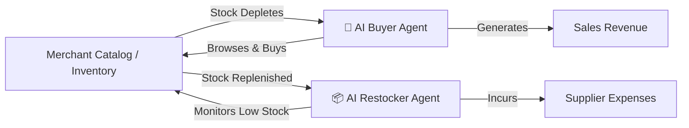

# Autonomous Agentic Commerce Engine 🤖🛒

[](https://nodejs.org/)
[](https://expressjs.com/)
[](https://razorpay.com/)

## Overview
The Autonomous Agentic Commerce Engine is a machine-to-machine (M2M) commerce platform demonstrating how AI agents interact with merchant infrastructure. 

This project demonstrates two contrasting autonomous agents operating within a highly advanced, dynamic market simulation:
1. **The AI Buyer (External Consumer):** Simulates external market demand. It browses the catalog, autonomously decides what to purchase based on availability, and executes Razorpay checkouts, generating **Sales Revenue** and depleting stock.
2. **The AI Restocker (Internal Manager):** Works for the merchant. It monitors inventory levels and automatically pays suppliers via Razorpay to replenish the warehouse, incurring **Supplier Expenses**.

## 🌟 Advanced Platform Features

### ⚡ Algorithmic Dynamic Pricing Engine
The platform continuously models real-world price elasticity based on inventory scarcity:
- **Scarcity Surge (+25%)**: Automatically scales up price when item stock drops to 2 or fewer units to protect inventory.
- **Overstock Flash Sale (-15%)**: Automatically discounts overabundant stock (≥ 15 units) to incentivize buyer agents.

### 📊 Real-Time Financial Velocity Analytics
An interactive dashboard plotting M2M economic activity:
- Live SVG line chart plotting cumulative **Sales Revenue**, **Supplier Expenses**, and **Net Profit** across agent trading cycles.
- Metrics cards tracking active surge counts, zero-stock events, and capital velocity.

### 🤖 AI Strategy & Personality Configurator
Customize agent behavior on the fly:
- **AI Buyer Personalities**: 
  - `🎯 Zero-Stock Hunter`: Targets low-stock items to force and verify auto-restock triggers.
  - `🏷️ Bargain Hunter`: Specifically targets discounted SKUs.
  - `🛡️ Frugal Saver`: Restricts purchases to low-cost items under a set threshold.
  - `🎲 Balanced Explorer`: Random market sourcing.
- **AI Restocker Modes**: Choose between `⚡ Zero-Stock Only (Just-In-Time)` and `📦 Proactive Threshold Restock`.

### 💎 Premium Glassmorphism UI
A highly polished, cyber-themed glassmorphism interface featuring:
- Frosted glass panels with smooth specular reflection lighting (`backdrop-filter`).
- Animated floating ambient orbs and glowing perspective mesh grids.
- An interactive, responsive HTML5 Canvas particle constellation background.

## Agent Architecture



## Quick Start

1. **Clone the repository:**
   ```bash
   git clone <repository-url>
   cd <repository-directory>
   ```

2. **Install dependencies:**
   ```bash
   npm install
   ```

3. **Environment Setup:**
   Copy `.env.example` to `.env` and fill in your Razorpay test keys:
   ```bash
   cp .env.example .env
   ```

4. **Start the backend server:**
   ```bash
   npm run dev
   ```
   *(This starts the Express server on port 3000)*

5. **Run the autonomous agent:**
   Open `http://localhost:3000` in your browser. Use the **Agent Controls** panel to start either the Buyer or the Restocker agent.

## API Reference

| Endpoint | Method | Description |
|----------|--------|-------------|
| `/api/inventory` | GET | List available products with dynamic pricing |
| `/api/checkout` | POST | Initiate purchase (Buyer) |
| `/api/restock` | POST | Initiate restock (Restocker) |
| `/api/ledger` | GET | View audit ledger |
| `/api/analytics` | GET | Fetch real-time M2M financial metrics |

## Strict Financial Guardrails

The system enforces strict financial guardrails to prevent AI runaway spending:
- **Maximum Transaction Amount**: Hard cap of ₹5,000 (500,000 paise) per transaction enforced by the backend.
- **Dynamic Quantity Scaling**: AI intelligence mathematically reduces its desired order quantities until the cart fits within the budget constraint.
- **Circuit Breaker**: Halts the agent loop and shuts down if sequential failures exceed thresholds.
