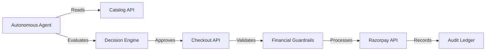
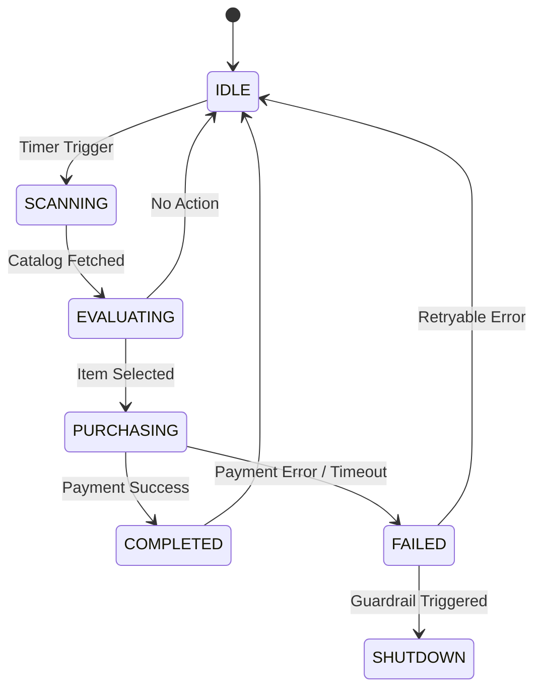

# Autonomous Agentic Commerce Engine 🤖🛒

[](https://www.python.org/downloads/release/python-3120/)
[](https://fastapi.tiangolo.com)
[](https://razorpay.com/)

## Overview
The Autonomous Agentic Commerce Engine is a headless, machine-to-machine (M2M) commerce platform where AI agents autonomously scan catalogs, evaluate items, and perform automated checkout using Razorpay (Test Mode) with built-in financial guardrails.

## Architecture



## Agent State Machine



## Quick Start

1. **Clone the repository:**
   ```bash
   git clone <repository-url>
   cd Razorpay
   ```

2. **Create virtual environment (Windows):**
   ```powershell
   python -m venv .venv
   .\.venv\Scripts\activate
   ```

3. **Install dependencies:**
   ```bash
   pip install -r requirements.txt
   ```

4. **Environment Setup:**
   Copy `.env.example` to `.env` and fill in your Razorpay test keys:
   ```bash
   cp .env.example .env
   ```

5. **Start the backend server:**
   ```bash
   uvicorn backend.main:app --reload
   ```

6. **Run the autonomous agent:**
   In a new terminal:
   ```bash
   python run_agent.py --cycles 5
   ```

## API Reference

| Endpoint | Method | Description | Example Request | Example Response |
|----------|--------|-------------|-----------------|------------------|
| `/api/catalog` | GET | List available products | `GET /api/catalog` | `[{"id": 1, "name": "API Key", "price": 10000}]` |
| `/api/checkout` | POST | Initiate purchase | `{"product_id": 1}` | `{"status": "success", "order_id": "order_xyz"}` |
| `/api/ledger` | GET | View audit ledger | `GET /api/ledger` | `[{"tx_id": "tx_123", "amount": 10000}]` |

## Audit Ledger

Transactions are immutably recorded in the ledger. You can view the ledger either via the API endpoint:
```bash
curl http://localhost:8000/api/ledger
```
Or by checking the raw log file:
```bash
cat transactions.log
```

## Financial Guardrails

The system enforces strict financial guardrails:
- **Maximum Transaction Amount**: Hard cap of ₹5,000 (500,000 paise) per transaction.
- **Circuit Breaker**: Halts operations if sequential failures exceed thresholds.

## Testing

Run the test suite:
```bash
pytest -v
```

## Graceful Failure Handling

The agent is resilient to network timeouts, API rate limits, and gateway errors.
- **Timeouts**: Logs the failure and retries during the next cycle.
- **Errors**: Non-retryable errors (e.g., guardrail violations) trigger an immediate shutdown to prevent financial loss.

## Deployment

### Render / Railway
1. Push repository to GitHub.
2. Connect repository to Render or Railway.
3. Set build command: `pip install -r requirements.txt`.
4. Set start command: `uvicorn backend.main:app --host 0.0.0.0 --port $PORT`.
5. Add environment variables from your `.env` file in the dashboard.

## Tech Stack

| Component | Technology |
|-----------|------------|
| Language | Python 3.12+ |
| Backend | FastAPI |
| Payment Gateway | Razorpay (Test) |
| Persistence | SQLite |
| Data Validation | Pydantic v2 |

## Project Structure
```text
Razorpay/
├── backend/
│   ├── main.py
│   ├── api/
│   ├── models/
│   └── services/
├── docs/
│   └── architecture.md
├── run_agent.py
├── requirements.txt
├── .env.example
├── .gitignore
├── Dockerfile
└── README.md
```
