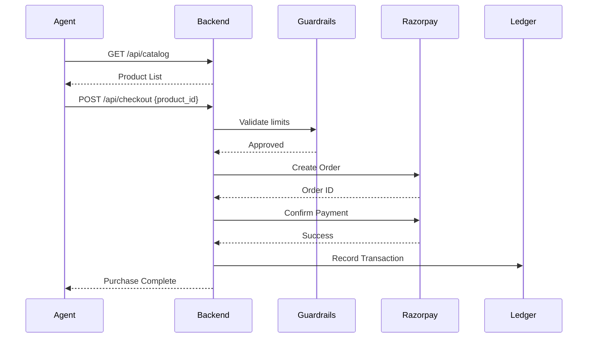
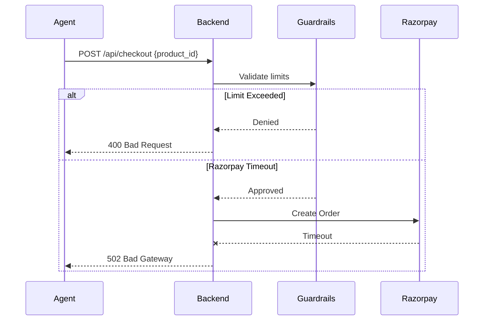

# System Architecture

## Overview
The AutonoMart operates using a decoupled architecture, separating the autonomous agent logic from the backend commerce APIs.

## Components
- **Agent Node**: A continuous process scanning the catalog and evaluating purchase decisions based on internal rules or external AI models.
- **Backend Service (FastAPI)**: Hosts the mock catalog, payment orchestration, and ledger.
- **Payment Gateway**: Integration with Razorpay (Test Mode) to handle simulated order creation and transactions.
- **Guardrail Service**: Enforces hard limits (e.g., maximum transaction amount).

## Purchase Flow

## Failure Scenario (Timeout / Limits)

## Data Model
- **Products**: `id`, `name`, `description`, `price_paise`, `inventory`
- **Transactions**: `tx_id`, `product_id`, `amount_paise`, `status`, `timestamp`

## Guardrails
- **Max Tx Limit**: Prevent anomalous logic from creating huge orders.
- **Daily Budget**: Cap overall spend per cycle/day.
- **Velocity Limit**: Maximum N transactions per hour.

## Audit Trail
Transactions are serialized as JSON line entries in `transactions.log` and persisted to SQLite for reporting.
